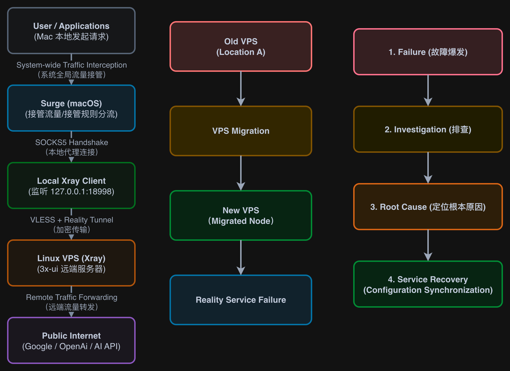
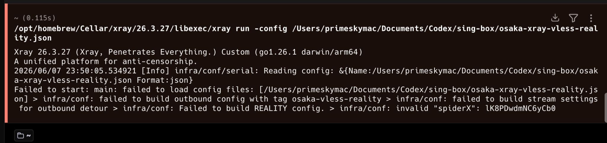
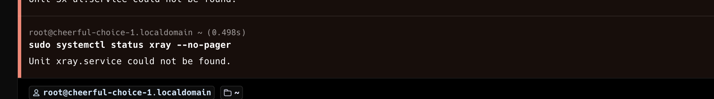
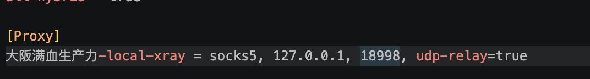
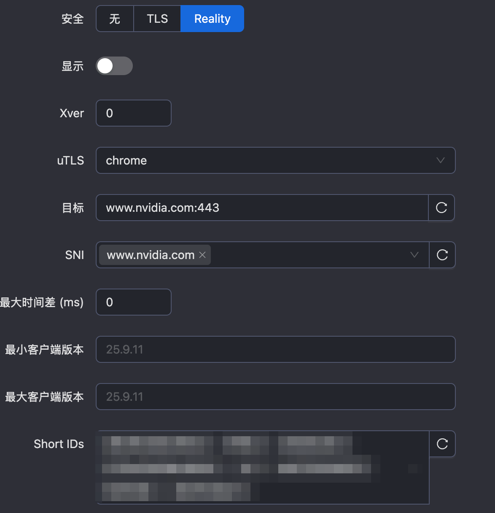
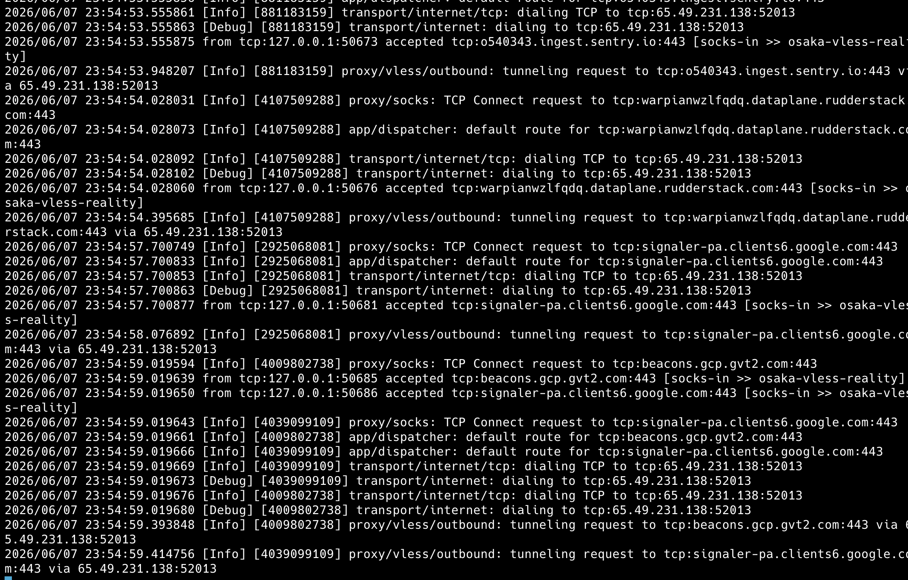

# vps-migration-reality-recovery
Personal VPS infrastructure project involving Reality deployment, migration, troubleshooting, and service recovery.
# Reality Service Recovery After VPS Migration

A personal infrastructure case study documenting the deployment, migration, troubleshooting, and recovery of a Reality-based VPS proxy service integrated with Surge and Xray.

---

## Architecture & Incident Timeline



This diagram summarizes the overall system architecture, the VPS migration event, the resulting Reality service failure, the investigation process, and the final recovery workflow.

---

## Project Background

The original VPS service was already functional through Clash-compatible subscription links.

However, my primary client was Surge on macOS and iOS. Since Surge did not directly support the same VLESS + Reality workflow in my setup, I introduced a local Xray client as a bridge between Surge and the remote VPS.

The resulting traffic flow was:

```text
User Applications
        ↓
      Surge
        ↓
 Local Xray Client
        ↓
 VLESS + Reality
        ↓
    Linux VPS
        ↓
 Public Internet
```

After the VPS was migrated to a new node, the service stopped working even though the server remained online. This turned a simple infrastructure migration into a troubleshooting and recovery project.

---

## Technical Environment

### Server Side

- Linux VPS
- Xray-core
- 3x-ui
- VLESS
- Reality
- TCP transport

### Client Side

- macOS
- Surge
- Local Xray Client
- sing-box, used during troubleshooting

### Supporting Tools

- SSH
- SOCKS5
- JSON configuration files
- TCP/IP diagnostics
- Linux service status checks
- Log analysis

---

## Failure Symptoms

After migration, the service showed the following symptoms:

- Existing configurations no longer worked.
- Surge could still connect to the local proxy layer.
- Local Xray could start and listen locally.
- The VPS remained reachable.
- The target port appeared open.
- Public internet access through the proxy failed.
- Reality/VLESS negotiation failed.

### Reality Configuration Error



This error showed that the issue was not only a simple network reachability problem. Part of the failure involved Reality-related configuration validation.

---

## Investigation Process

The troubleshooting process covered multiple layers of the system.

### Server-Side Checks

- Verified service status.
- Checked listening ports.
- Checked whether Xray was running under 3x-ui.
- Confirmed that the VPS itself was reachable.

### Client-Side Checks

- Verified the local Xray process.
- Checked whether Xray was listening on the expected local port.
- Confirmed that Surge was pointing to the correct local SOCKS5 proxy.
- Tested whether local requests were reaching Xray.

### Protocol and Configuration Checks

Reality requires strict matching between client-side and server-side parameters. The investigation included checking:

- UUID
- Public Key
- Short IDs
- Server Name / SNI
- SpiderX
- Reality settings
- ML-DSA related parameters

### Troubleshooting Evidence



This stage helped separate basic network reachability problems from Reality protocol negotiation problems.

---

## Reality Configuration Analysis

A key part of the investigation was reviewing the Reality inbound configuration generated by 3x-ui.



Important configuration areas included:

- Reality mode
- Target server
- SNI
- Short IDs
- Client compatibility settings

This step was necessary because Reality can fail even when the VPS and port are reachable.

---

## Local Xray Verification

Before focusing on the remote server, the local proxy layer had to be validated.



This confirmed that:

- Xray was running locally.
- The local SOCKS5 listener was active.
- Surge had a valid local proxy target.

This ruled out several local configuration issues.

---

## Root Cause Analysis

The root cause was configuration inconsistency after VPS migration and repeated regeneration of Reality-related parameters.

The important finding was:

```text
Network Reachability ≠ Protocol Validity
```

In this case:

- The VPS was reachable.
- The service port could be contacted.
- Local Xray was running.
- Surge could connect to the local proxy.
- Reality handshakes still failed.

This indicated that the failure was caused by mismatched Reality/VLESS parameters rather than a simple offline server or closed port.

---

## Service Recovery

Recovery involved:

1. Reviewing the active server-side Reality inbound configuration.
2. Regenerating required Reality parameters.
3. Synchronizing client-side and server-side configuration values.
4. Restarting affected local and remote services.
5. Re-testing local SOCKS5 behavior.
6. Verifying end-to-end traffic forwarding.

### Recovery Verification



The recovery logs showed that local SOCKS requests were accepted and VLESS outbound tunnels were successfully established through the remote VPS.

---

## Key Lessons Learned

### 1. Deployment Is Easier Than Recovery

Installing Linux, Xray, and 3x-ui was relatively straightforward. The most valuable learning happened during the failure investigation and recovery process.

### 2. Open Ports Do Not Guarantee Working Protocols

A reachable VPS and open TCP port do not guarantee that Reality/VLESS negotiation will succeed.

### 3. Configuration Drift Can Break Infrastructure

After migration, regenerated or mismatched parameters can silently break an otherwise reachable service.

### 4. Layered Proxy Chains Require Clear Mental Models

The final working chain involved multiple layers:

```text
Surge
↓
Local Xray Client
↓
VLESS + Reality
↓
Linux VPS
↓
Public Internet
```

Understanding each layer was essential for troubleshooting.

---

## Skills Demonstrated

### Linux Administration

- VPS management
- Remote service validation
- Process inspection
- Service troubleshooting

### Networking

- TCP/IP diagnostics
- Port validation
- SOCKS5 proxy behavior
- Client-server traffic flow analysis

### Secure Proxy Infrastructure

- Xray
- Reality
- VLESS
- Surge integration
- Local proxy bridging

### Problem Solving

- Root-cause analysis
- Migration recovery
- Configuration synchronization
- Multi-stage debugging

---

## Configuration Templates

This repository includes anonymized configuration templates used during the project.

### Included Templates

- `configs/xray-client-template.json`
- `configs/surge-template.conf`

The templates demonstrate how Surge was integrated with a Reality-based VPS service through a local Xray bridge.

```text
Surge
↓
SOCKS5
↓
Local Xray
↓
VLESS + Reality
↓
Linux VPS
```

---

## Repository Structure

```text
vps-migration-reality-recovery

├── README.md
│
├── images
│   ├── architecture.png
│   ├── reality-build-error.png
│   ├── troubleshooting.png
│   ├── reality-config.png
│   ├── local-xray-listener.png
│   └── recovery-success.png
│
├── configs
│   ├── xray-client-template.json
│   └── surge-template.conf
│
└── docs
    └── reality-troubleshooting.md
```text

This repository contains:

- Architecture documentation
- Migration and recovery evidence
- Anonymized configuration templates
- Troubleshooting records
```

---

## Future Improvements

Possible improvements include:

- Automated configuration backups.
- Version-controlled anonymized configuration templates.
- Migration validation checklist.
- Monitoring and alerting for local and remote proxy services.
- Clearer documentation of active client/server parameters.

---

## Disclaimer

This repository is a personal learning and infrastructure troubleshooting case study.

All sensitive information has been removed or anonymized before publication, including:

- Real IP addresses
- Domains
- UUIDs
- Public keys
- Private keys
- Short IDs
- SpiderX values
- Passwords
- API keys
